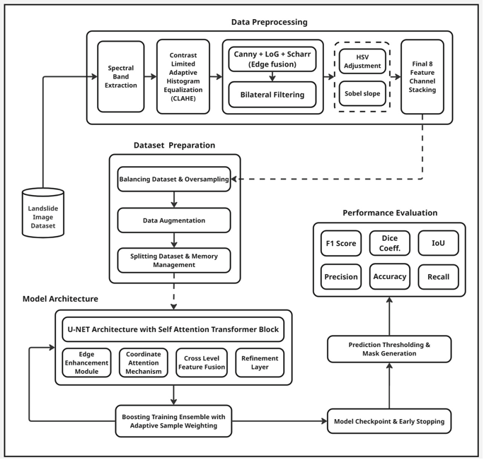
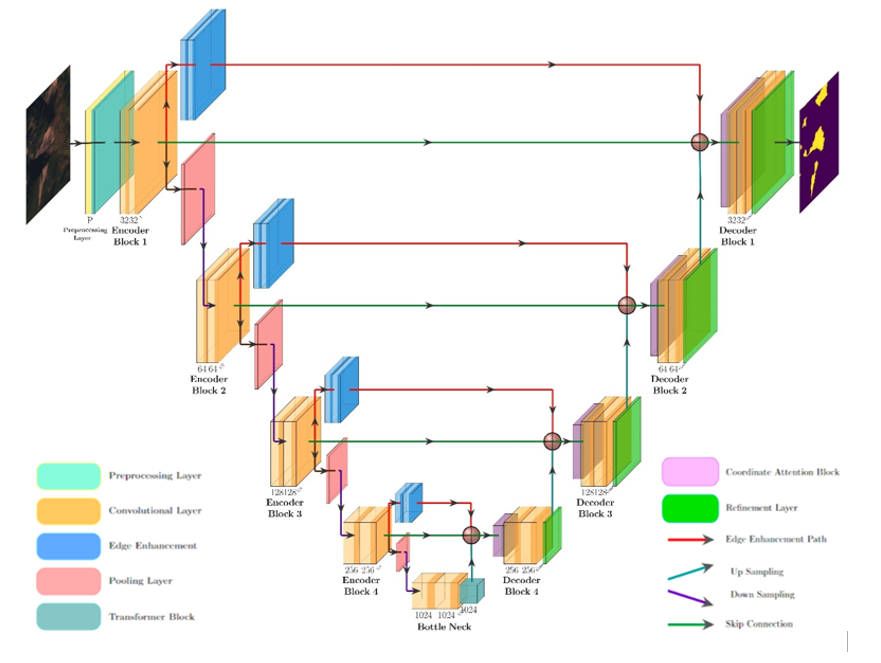

# Transformer-Based Landslide Detection using Cross-Resolution Feature Fusion

### A Deep Learning + Explainable AI Framework for Automatic Landslide Mapping

---

## 📘 Overview

This project presents a **Hybrid CRFF Transformer U-Net** model for high-precision landslide segmentation using multi-spectral satellite imagery.  
It integrates:

- Transformer-based long-range spatial modeling  
- Cross-Resolution Feature Fusion (CRFF)  
- Coordinate Attention  
- Edge Enhancement Module  
- Hybrid Dice–Tversky optimization  
- Integrated Gradients (IG) explainability  
- Adaptive Mamdani Fuzzy Logic for interpretable risk scoring  

---

## 🧩 Key Features

- **CRFF + Transformer-based U-Net**  
- **Cross-resolution feature fusion** for stronger multi-scale consistency  
- **Coordinate attention** for terrain-aware feature refinement  
- **Edge enhancement module** for sharp landslide boundaries  
- **Hybrid Dice–Tversky loss** to combat class imbalance  
- **Eight-channel multispectral input fusion** (RGB, NDVI, SWIR1, SWIR2, slope, elevation, edge map, enhanced RGB)  
- **Integrated Gradients** for spectral-band attribution  
- **Fuzzy Logic Module** providing expert-interpretable landslide risk levels  

---

## 🖼️ System Architecture

---

## 🛠️ Data Preprocessing Pipeline

The updated preprocessing pipeline includes all operations from the workflow:

### **1. Spectral Band Extraction**
- Extract required subsets from 14-band HDF5 tiles  
- Compute NDVI, SWIR1, SWIR2, slope (Sobel), and elevation bands  

### **2. Contrast Enhancement**
- Apply **CLAHE in LAB color space** for local luminance correction  
- Enhances terrain details without amplifying noise  

### **3. Multi-Scale Edge Fusion**
- **Canny** - fine edges  
- **LoG** - blob-scale structure  
- **Scharr** - high-precision gradient  
- Combined into a unified edge map for boundary guidance  

### **4. Bilateral Filtering**
- Smoothes homogeneous regions while preserving slope discontinuities  

### **5. HSV Adjustment**
- Normalizes hue–saturation spectrum  
- Stabilizes shadowed and vegetation-heavy regions  

### **6. Sobel Slope Generation**
- Computes pixel-wise slope gradient magnitude  
- Critical for geomorphological terrain interpretation  

### **7. Final 8-Channel Feature Stacking**
Creates the enhanced input volume:
- Enhanced RGB (post-CLAHE)  
- NDVI  
- SWIR1  
- SWIR2  
- Elevation  
- Sobel Slope  
- Edge Fusion Map  
- Bilateral-filtered RGB  

---

## 🗺️ Dataset

- **Dataset:** Landslide4Sense  
- **Format:** 14-band HDF5 tiles  
- **Selected & generated channels:** RGB, NDVI, SWIR1, SWIR2, slope, elevation  
- **Split:** Train 70% • Val 15% • Test 15%  
- Includes severe class imbalance → addressed via oversampling + augmentation  

---

## 🏗️ Model Architecture (Hybrid CRFF Transformer U-Net)

Core architectural blocks:

- **Encoder:** multi-scale hierarchical feature extraction  
- **Transformer bottleneck:** long-range contextual modeling  
- **CRFF:** merges low/high resolution features  
- **Coordinate Attention:** spatially selective weighting across axes  
- **Edge Enhancement Module:** adds gradient cues from preprocessing  
- **Decoder:** restores spatial resolution with skip connections  

---

## ⚙️ Training

- **Optimizer:** Adam  
- **Loss:** Hybrid Dice–Tversky Loss  
- **Metrics:** F1, IoU, Dice Coefficient, Precision, Recall  
- **Boosting:** Adaptive sample-weighted ensemble  
- **Dataset balancing:** Oversampling + augmentation pipeline  

---

## 📈 Results

| Metric | Score |
|--------|--------|
| **F1 Score** | **0.938** |
| **Mean IoU** | **0.835** |
| **Accuracy** | **0.995** |

Highlights:

- Precise segmentation of small landslide scars  
- Strong boundary continuity  
- Robust generalization across varied terrains  
- High stability between training/validation curves  

---

## 🔍 Explainability (Integrated Gradients)

The IG analysis reveals the strongest influence from:

- **NDVI** (vegetation disturbance)  
- **SWIR1 / SWIR2** (moisture & mineral signals)  
- **Slope** (terrain gradient)  
- **Elevation**  
- **RGB texture cues**

Confirms physically meaningful model reasoning.

---

## 🧠 Fuzzy Risk Interpretation

A Mamdani fuzzy inference system converts model outputs + terrain indicators into:

- **Low Risk**  
- **Moderate Risk**  
- **High Risk**  
- **Critical Risk**

Enhances interpretability for field engineers and GIS operators.

---

## Challenges Faced
- Achieving a significantly higher mean IoU than baseline and prior models was extremely challenging, since landslides cover very small, irregular regions that make IoU highly sensitive to errors.
- Improving IoU required designing specialized modules (CRFF, edge enhancement, coordinate attention) and tuning them carefully to capture both global terrain context and fine boundaries simultaneously.
- Outperforming existing state-of-the-art landslide models while keeping the architecture lightweight demanded intense optimization, custom feature fusion, and removing unnecessary heavy components.
- Balancing model complexity vs performance was difficult: the goal was to stay lighter than transformer-heavy architectures but still achieve stronger segmentation metrics.
- Extensive experiments were needed to reach a setup that increased IoU, reduced false positives, and preserved slope boundaries across diverse terrains.
- The combination of multi-modal data fusion and boundary-focused refinement was essential to boost IoU, but making all components work efficiently took a lot of iteration.
